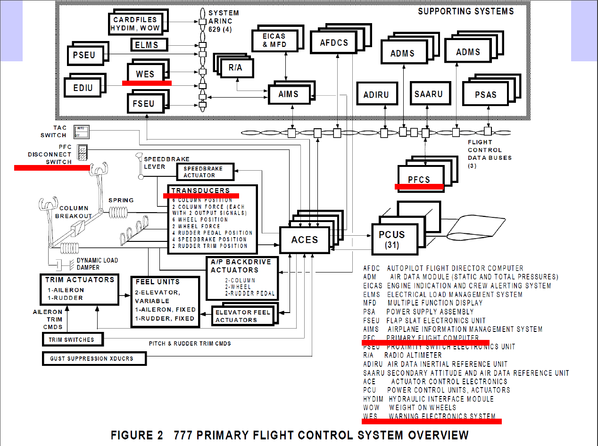

# Fly-By-Wire

L'obiettivo del progetto è quello di costruire una simulazione della comunicazione (in parte) di un sistema Fly-By-Wire.

Il fly by wire è un sistema che sostituisce i tradizionali comandi di volo diretti con un sistema di comando elettronico digitale.

Per poter acquisire dati verrà usato il sistema di comunicazione dati nmea utilizzato soprattutto in nautica e nella comunicazione di dati gps. Il progetto si basa su dati raccolti da un GARMIN G18 in ambiente aperto.
Nel nostro caso analizzeremo solamente la riga che inizia con il target $GPGLL.

$GPGLL = Geographic position, latitude / longitude

I componenti che utilizzeremo saranno 5:
* PFC corrispondente a 3 processi chiamati PFC1, PFC2 e PFC3
* Transducers
* Generatore Fallimenti
* WES
* PFC Disconnect Switch

In totale saranno 7 processi, di cui alcuni per poter portare a termine le operazioni ne generano altri figli.

###  PFC
Il comportamento funzionale di questi 3 componenti è il seguente:

Acquisisce un nuovo record NMEA GPGLL dal file in input (nel nostro caso G18.txt)
Estrae le coordinate
Calcola la distanza percorsa rispetto alle coordinate acquisite
Conseguentemente calcola la velocità attuale (all’avvio, la velocità è 0)
Comunica la velocità elaborata a Transducers, tramite le seguenti modalità:
*PFC1 comunica tramite una socket
*PFC2 comunica tramite una pipe
*PFC3 comunica tramite scrittura su un file condiviso

###  Transducers
Il processo deve acquisire a ogni istante la velocità inviata da PFC1, PFC2 e PFC3
Genera un log per ogni PFC: speedPFC1.log, speedPFC2.log e speedPFC3.
Nel caso di fallimenti i dati non saranno inviati e il transducer non potrà analizzarli.

###  Generatore Fallimenti
A ogni istante di tempo seleziona in modo casuale uno dei PFC
Viene inviato al processo scelto con probabilità:
* 0.01 invia un segnale SIGSTOP
* 0.0001 invia un segnale SIGINT
* 0.1 invia un segnale SIGCONT
* 0.1 invia un segnale SIGUSER1 che altera il valore del successivo calcolo della velocità, effettuando un left shift di 2 bits della velocità calcolata (dopo arrotondamento e cast a intero).

Logga l'azione su un file failures.log
Si possono verificare anche più di uno degli eventi definiti sopra durante lo stesso istante di tempo. Considerando che i PFC devono saper ricevere i segnali sopra descritti.

### WES
Processo controllore dei PFC notificando eventuali problemi ad ogni istante, accedendo ai log generati.

Possono verificarsi 3 eventi:
* Se tutti i log sono concordi allora segnala la correttezza con un OK.
* Se 2 sono concordi e 1 discorde viene inviato un messaggio di ERRORE, indicando il processo discorde.
* Se tutti e 3 sono discordi invia un messaggio di EMERGENZA.

Tutti i messaggi del WES sono stampati nello standard output e inseriti in un file di log chiamato status.log.

###  PFCDisconnectedSwitch
Questo processo è un osservatore di quello che viene notificato dal WES reagendo ai messaggi che vengono inviati:

In caso di ERRORE controlla lo stato del processo, una volta scoperto lo stato del processo viene:
*Aggiustato.
*Sbloccato.
*Riavviato.

In caso ci fosse bisogno di tare uno di queste operazioni su un processo, esso ripartire a leggere nel punto giusto del file G18.txt, per fare questo è necessario mantenere in un file separato il numero di riga letta dai file temporaneo "nextLine.txt". Infine Loggare l'attività svolta nel log chiamato switch.log.

In caso di EMERGENZA termina l'applicazione e dopo qualche secondo riavvia l'applicazione ripartendo a leggere dal punto in cui si è fermato(tramito nextLine).
										 

##  ESECUZIONE

[Consultare la relazione presente nel progetto, contiene dettagliatamente come avviare l'applicazione con illustrazioni.](RelazioneProgetto.pdf)
